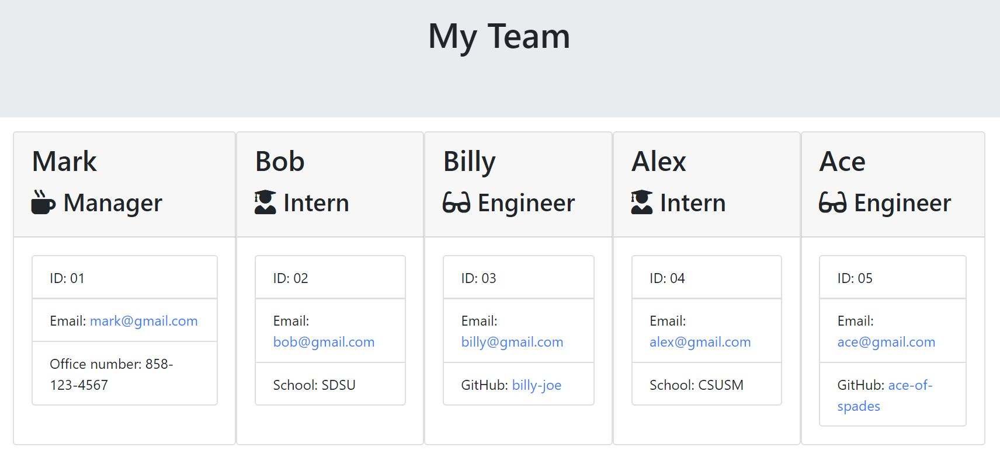

# template-Engine
Software engineering team generator command line application.

**User Story**

As a manager...
I want to generate a webpage that displays my team's basic info...
so that I have quick access to emails and GitHub profiles.

**Code style**

The application is written in JavaScript and HTML and is run through ther command line using Node.js. Unit tests were also used to build the classes.

**Build status**

The build status is complete.

**Screenshots**



**Code Example** 
```inquirer
    .prompt(initialQuestions)
    .then(function (user) {
        const templateMainFile = fs.readFileSync(`./templates/main.html`, { encoding: 'utf8' });
        const manager = new Manager(user.name, user.id, user.email, user.officeNumber);

        let team = renderHTML(manager);
        buildTeam(user.member, team, templateMainFile);
    }).catch(err => console.log(err));

async function buildTeam(chosenMember, team, templateMainFile) {
    try {
        switch (chosenMember) {
            case "Engineer":
                const engineer = await inquirer.prompt(engineerQuestions);
                let engineer1 = new Engineer(engineer.name, engineer.id, engineer.email, engineer.github);
                let engineer1Card = renderHTML(engineer1);
                team = team + engineer1Card;
                let addMember = await inquirer.prompt(moreMembersQuestion);
                chosenMember = addMember.additionalMember;

                if (chosenMember === "Engineer") {
                    buildTeam(chosenMember, team, templateMainFile);
                } else if (chosenMember === "Intern") {
                    buildTeam(chosenMember, team, templateMainFile);
                } else {
                    let temporaryMainFile = templateMainFile.replace('{{ team }}', team);
                    fs.writeFileSync("./output/index.html", temporaryMainFile);
                }
                break;
                ```
